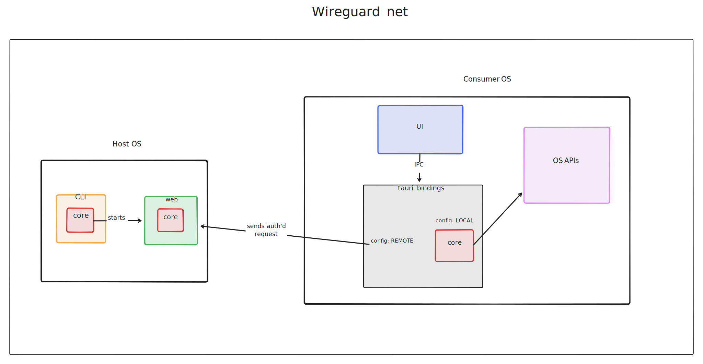

Kittynode is a command center for node operators. There is a README.md describing each package you'll find here in the monorepo. This document gives a high level architectural overview of Kittynode.

- [kittynode-core](https://github.com/kittynode/kittynode/tree/main/packages/core): Core library for Kittynode written in Rust.
- [kittynode-cli](https://github.com/kittynode/kittynode/tree/main/packages/cli): A CLI frontend that binds to kittynode-core.
- [kittynode-gui](https://github.com/kittynode/kittynode/tree/main/packages/gui): A GUI frontend that binds to kittynode-core.
- [kittynode-web](https://github.com/kittynode/kittynode/tree/main/packages/web): An authenticated local web server that binds routes to kittynode-core.

## Technology used

- Core library written in Rust
- Frontend written in SvelteKit (Svelte 5)
- CLI is a cross-platform Rust binary
- GUI is a cross-platform Tauri app that compiles the core library into the binary along with the frontend into a native webview, communicating with the core library over IPC, while being able to tap into native platform APIs

## User facing apps

Kittynode has two user facing apps:

- A command line interface (CLI)
- A graphical user interface (GUI)

These user facing apps manage a kittynode through the core library.

## Capabilities

There are several capabilities you can add to your Kittynode which augment the threat model.

- **Read only (default)**: Kittynode is a read-only monitoring application.
- **Local only**: Kittynode can update local node infrastructure from the host machine.
- **Private onchain requests**: Kittynode can update local node infrastructure via listening to private requests submitted onchain.
- **Local HTTPS server**: Kittynode can update local node infrastructure via requests that come from the same Wireguard network (but a different machine, such as a phone); these requests are authenticated by a passkey or JWT token.

We believe the local HTTPS server over Wireguard is a convenient and secure approach. But the choice is up to you.

## A diagram

